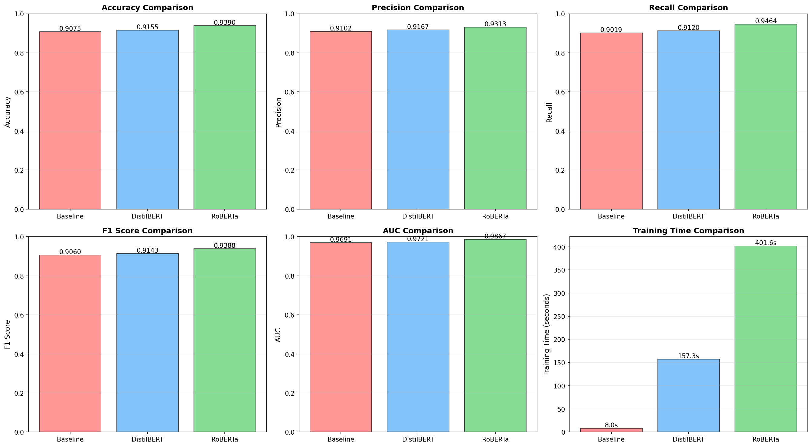
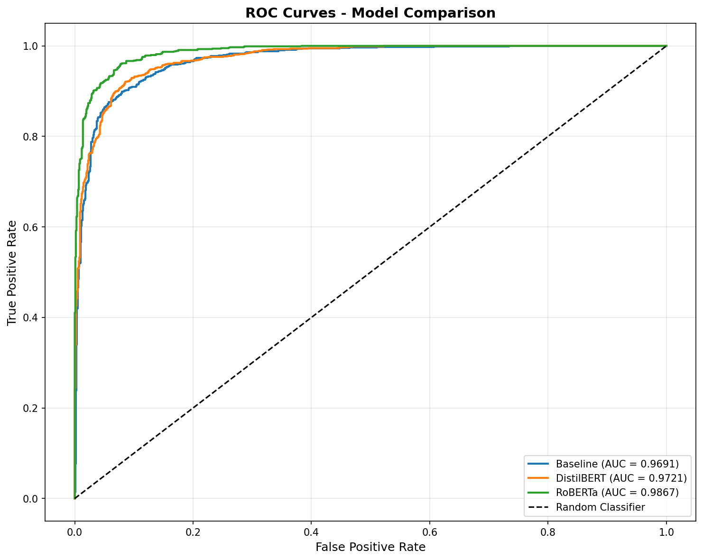
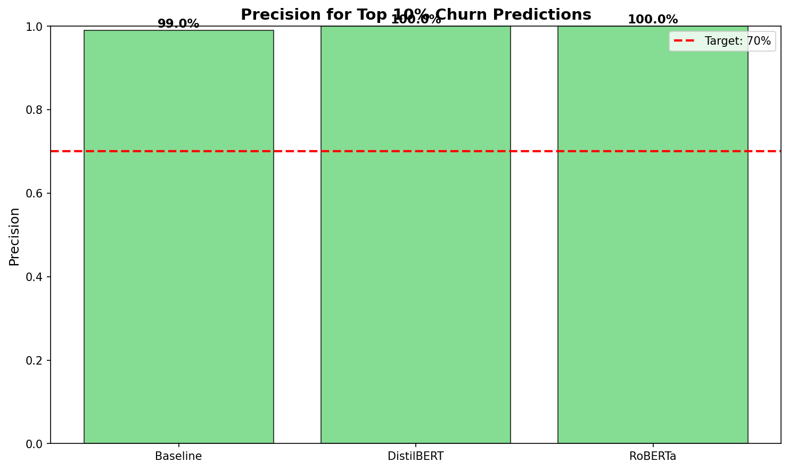
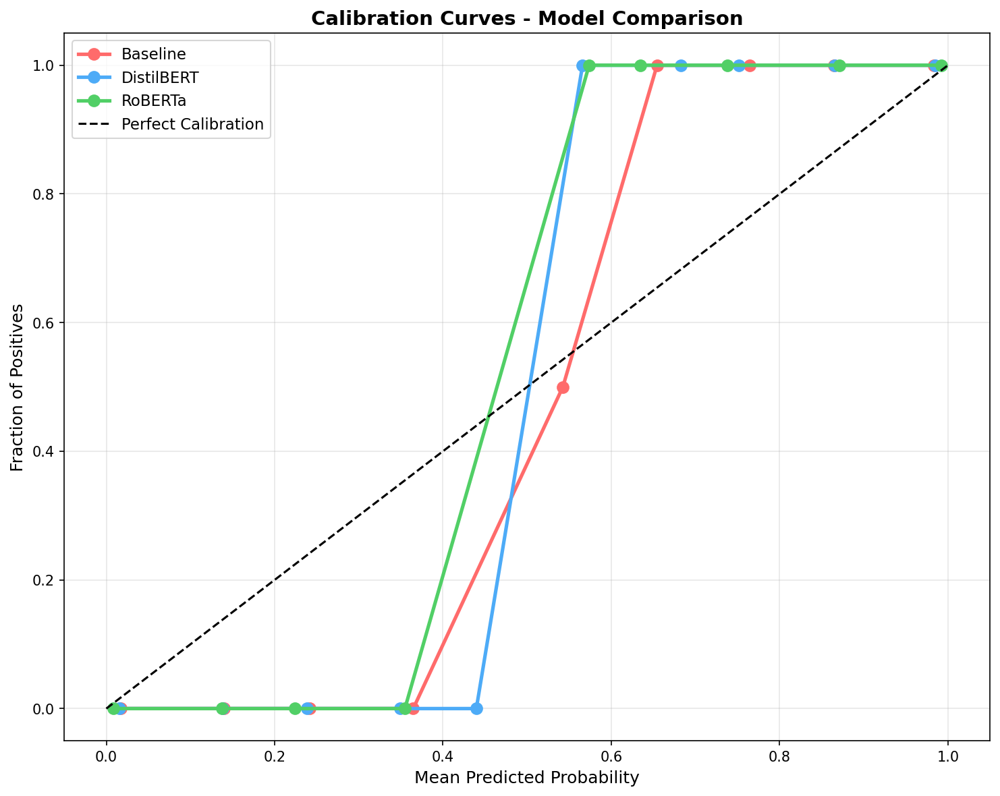
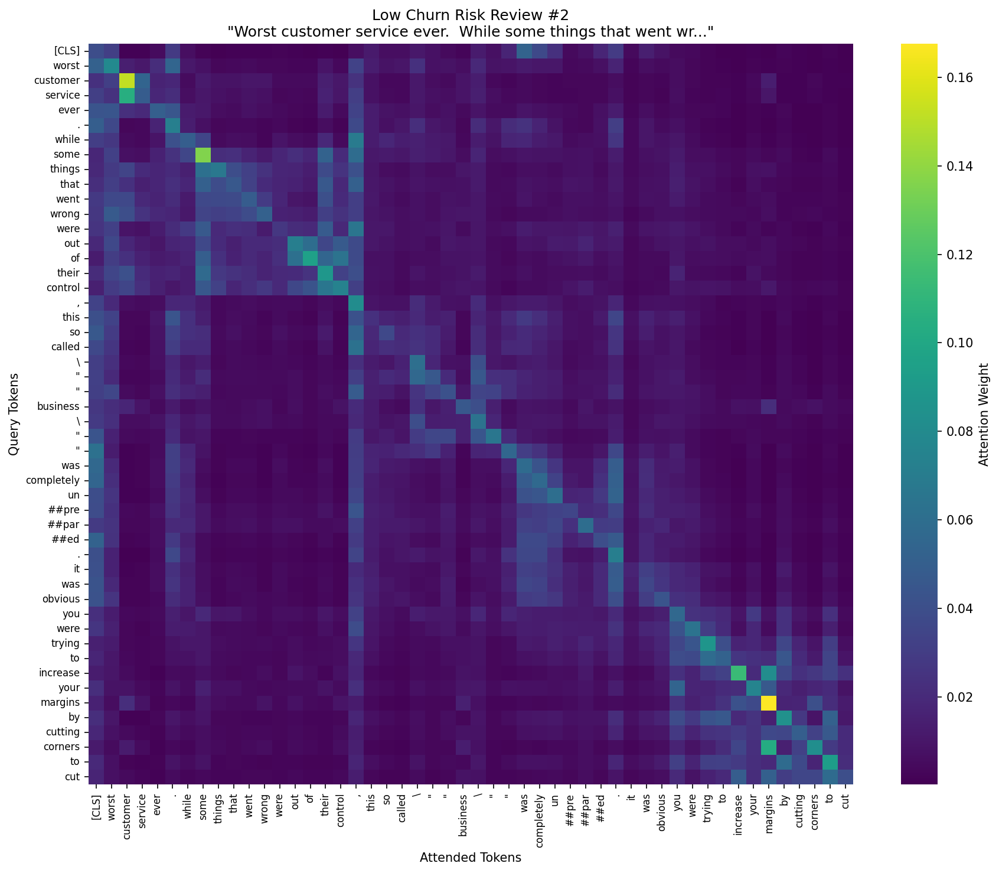
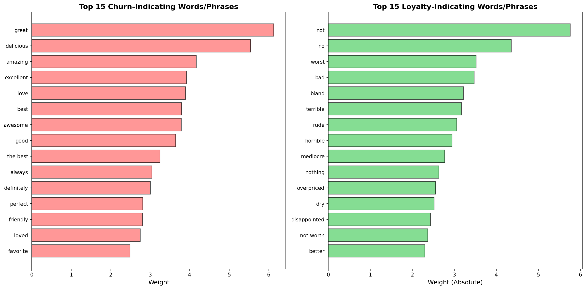
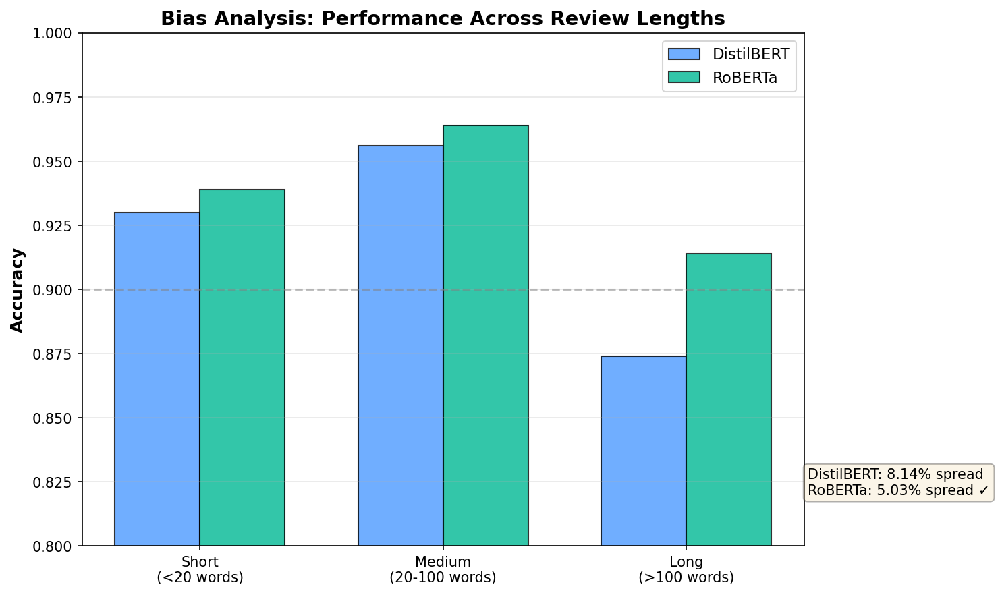

# Transformers for Customer Churn Prediction

---

## 1. Problem Statement

Customer churn is one of the most serious issues for customer-facing companies. Losing customers is costly and often preventable when the signals are detected early. Customer reviews contain patterns that reveal dissatisfaction and frustration which often appear well before a customer leaves.

The goal of this project is to determine whether churn risk can be predicted directly from customer review text using modern language models.

### Problem Question

**Can modern natural language models, especially transformer encoders with attention, predict churn risk from text with strong accuracy and clear interpretability?**

### Approach Overview

The project builds and compares three models:

1. **Classical Baseline:** TF-IDF and Logistic Regression
2. **DistilBERT:** Transformer fine-tuned on review text
3. **RoBERTa:** Transformer fine-tuned on the same task

### Why These Models?

**Baseline (TF-IDF + Logistic Regression):**
- Establishes whether churn prediction is learnable from text alone
- Provides interpretable feature importance (which words matter)
- Fast training and inference for comparison
- Industry-standard approach before deep learning

**DistilBERT (66M parameters, 6 layers):**
- Knowledge distillation from BERT → 40% smaller, 60% faster
- Proven performance on sentiment classification tasks
- Optimal for production deployment (speed/accuracy tradeoff)
- Tests whether smaller transformers suffice for this task

**RoBERTa (125M parameters, 12 layers):**
- Optimized BERT pretraining (longer training, larger batches, dynamic masking)
- Removed next-sentence prediction → better single-sequence understanding
- State-of-the-art performance on text classification benchmarks
- Tests whether maximum accuracy justifies increased computational cost

**Why Transformers for Churn Prediction?**

Customer reviews contain complex linguistic patterns that require contextual understanding:

- **Negation handling:** "not bad" vs "bad" require understanding word relationships
- **Sentiment intensity:** "good" vs "amazing" vs "mind-blowing" need graduated understanding
- **Long-range dependencies:** Complaints buried in otherwise positive reviews
- **Implicit dissatisfaction:** Subtle cues like "I guess it's okay" signal churn risk

Classical models (bag-of-words, TF-IDF) treat words independently and miss these contextual patterns. Transformers with self-attention can capture:
- Relationships between words across entire review
- Sentiment modifiers (negations, intensifiers)
- Implicit tone and dissatisfaction signals

Each model is evaluated on accuracy, precision, recall, F1, AUC, inference time, calibration, and interpretability. Visualizations are included throughout the report.

The end result is a complete natural language churn prediction framework plus an interactive Streamlit demonstration.

---

## 3. Methods and Techniques

### Data Source

The **Yelp Polarity dataset** is loaded from HuggingFace. This widely-used benchmark contains customer reviews with sentiment labels.

**Label Mapping:**
- Positive reviews (4-5 stars) → No churn risk (0)
- Negative reviews (1-2 stars) → Churn risk (1)

**Dataset Specifications:**
- Training: 10,000 samples
- Testing: 2,000 samples
- Balanced classes (50/50 distribution)
- Language: English

**Important Note:** Sentiment serves as a proxy for churn risk. The Limitations section discusses this assumption.

### Modeling Techniques Applied

#### **Classical Baseline**
- TF-IDF vectorization with 1-2 grams
- Maximum 5,000 features
- Logistic regression with L2 regularization
- Balanced class weights

#### **Transformer Models**
- **DistilBERT:** 6 layers, 66M parameters, knowledge distillation from BERT
- **RoBERTa:** 12 layers, 125M parameters, optimized pretraining
- Fine-tuning with HuggingFace Trainer API
- Mixed-precision GPU training (FP16)
- Learning rate: 2e-5 with warmup
- Batch size: 32
- Epochs: 3

#### **Evaluation Methods**
- Comprehensive metrics (accuracy, precision, recall, F1, AUC)
- ROC curves and calibration curves
- Confusion matrices
- Top-10% precision analysis
- Inference latency measurement
- Review length bias evaluation

#### **Interpretability Methods**
- Attention weight visualization
- SHAP (SHapley Additive exPlanations)
- Feature importance from baseline model

---

## 4. Code Demonstration

### 4.1 Data Loading and Label Mapping

```python
from datasets import load_dataset
import pandas as pd

# Load Yelp Polarity dataset from HuggingFace
dataset = load_dataset("yelp_polarity")

# Map sentiment to churn labels
# Positive (label=2) -> no churn (0)
# Negative (label=1) -> churn (1)
def map_label(example):
    example["label"] = 1 if example["label"] == 1 else 0
    return example

dataset = dataset.map(map_label)

# Convert to pandas for easier manipulation
train_df = pd.DataFrame(dataset["train"])
test_df = pd.DataFrame(dataset["test"])

# Sample for training efficiency
train_df = train_df.sample(10000, random_state=42)
test_df = test_df.sample(2000, random_state=42)
```

### 4.2 Baseline: TF-IDF and Logistic Regression

```python
from sklearn.feature_extraction.text import TfidfVectorizer
from sklearn.linear_model import LogisticRegression
from sklearn.metrics import classification_report, roc_auc_score

# TF-IDF vectorization
vectorizer = TfidfVectorizer(
    ngram_range=(1, 2),  # Unigrams and bigrams
    max_features=5000,   # Vocabulary size
    min_df=5,           # Minimum document frequency
    max_df=0.8          # Maximum document frequency
)

X_train = vectorizer.fit_transform(train_df["text"])
X_test = vectorizer.transform(test_df["text"])

y_train = train_df["label"]
y_test = test_df["label"]

# Logistic regression with balanced weights
lr_model = LogisticRegression(
    max_iter=2000,
    class_weight='balanced',
    random_state=42
)
lr_model.fit(X_train, y_train)

# Predictions
y_pred = lr_model.predict(X_test)
y_proba = lr_model.predict_proba(X_test)[:, 1]

# Evaluation
print(classification_report(y_test, y_pred))
print("AUC:", roc_auc_score(y_test, y_proba))
```

### 4.3 Saving the Baseline Model

```python
import pickle
import os

os.makedirs("churn_model", exist_ok=True)

# Save for deployment
with open("churn_model/lr_model.pkl", "wb") as f:
    pickle.dump(lr_model, f)

with open("churn_model/tfidf_vectorizer.pkl", "wb") as f:
    pickle.dump(vectorizer, f)
```

### 4.4 Transformer Tokenization

```python
from transformers import AutoTokenizer

# Load pretrained tokenizers
distilbert_tokenizer = AutoTokenizer.from_pretrained("distilbert-base-uncased")
roberta_tokenizer = AutoTokenizer.from_pretrained("roberta-base")

# Tokenization function
def tokenize(batch):
    return distilbert_tokenizer(
        batch["text"],
        truncation=True,
        padding="max_length",
        max_length=128
    )

# Apply to dataset
tokenized_train = dataset["train"].map(tokenize, batched=True)
tokenized_test = dataset["test"].map(tokenize, batched=True)
```

### 4.5 Fine-Tuning DistilBERT

```python
from transformers import AutoModelForSequenceClassification, TrainingArguments, Trainer
import numpy as np
import evaluate

# Load evaluation metrics
accuracy = evaluate.load("accuracy")
precision = evaluate.load("precision")
recall = evaluate.load("recall")
f1 = evaluate.load("f1")

# Metrics computation
def compute_metrics(eval_pred):
    logits, labels = eval_pred
    predictions = np.argmax(logits, axis=-1)
    return {
        "accuracy": accuracy.compute(predictions=predictions, references=labels)["accuracy"],
        "precision": precision.compute(predictions=predictions, references=labels)["precision"],
        "recall": recall.compute(predictions=predictions, references=labels)["recall"],
        "f1": f1.compute(predictions=predictions, references=labels)["f1"],
    }

# Load pretrained DistilBERT
model = AutoModelForSequenceClassification.from_pretrained(
    "distilbert-base-uncased",
    num_labels=2
)

# Training configuration
training_args = TrainingArguments(
    output_dir="distilbert_output",
    learning_rate=2e-5,
    per_device_train_batch_size=32,
    per_device_eval_batch_size=32,
    evaluation_strategy="epoch",
    save_strategy="epoch",
    num_train_epochs=3,
    weight_decay=0.01,
    warmup_steps=500,
    fp16=True,
    load_best_model_at_end=True,
    metric_for_best_model="f1",
)

# Initialize Trainer
trainer = Trainer(
    model=model,
    args=training_args,
    train_dataset=tokenized_train,
    eval_dataset=tokenized_test,
    compute_metrics=compute_metrics,
)

# Fine-tune the model
trainer.train()
```

### 4.6 Fine-Tuning RoBERTa

```python
# Load RoBERTa
roberta_model = AutoModelForSequenceClassification.from_pretrained(
    "roberta-base",
    num_labels=2
)

# Training configuration (same as DistilBERT)
roberta_training_args = TrainingArguments(
    output_dir="roberta_output",
    learning_rate=2e-5,
    per_device_train_batch_size=32,
    per_device_eval_batch_size=32,
    evaluation_strategy="epoch",
    save_strategy="epoch",
    num_train_epochs=3,
    weight_decay=0.01,
    warmup_steps=500,
    fp16=True,
    load_best_model_at_end=True,
    metric_for_best_model="f1",
)

roberta_trainer = Trainer(
    model=roberta_model,
    args=roberta_training_args,
    train_dataset=tokenized_train,
    eval_dataset=tokenized_test,
    compute_metrics=compute_metrics,
)

# Fine-tune RoBERTa
roberta_trainer.train()
```

### 4.7 Model Evaluation and Visualization

#### Confusion Matrix

```python
from sklearn.metrics import confusion_matrix, ConfusionMatrixDisplay
import matplotlib.pyplot as plt

# Generate confusion matrix
cm = confusion_matrix(y_test, y_pred)

# Visualize
disp = ConfusionMatrixDisplay(
    confusion_matrix=cm,
    display_labels=['No Churn', 'Churn']
)
disp.plot(cmap='Blues')
plt.title('Confusion Matrix - Baseline Model')
plt.savefig("outputs/confusion_matrices.png", dpi=150, bbox_inches='tight')
plt.show()
```

#### ROC Curve

```python
from sklearn.metrics import roc_curve, auc

# Calculate ROC curve
fpr, tpr, thresholds = roc_curve(y_test, y_proba)
roc_auc = auc(fpr, tpr)

# Plot
plt.figure(figsize=(8, 6))
plt.plot(fpr, tpr, label=f'Baseline (AUC = {roc_auc:.4f})')
plt.plot([0, 1], [0, 1], 'k--', label='Random Classifier')
plt.xlabel('False Positive Rate')
plt.ylabel('True Positive Rate')
plt.title('ROC Curve - Model Comparison')
plt.legend()
plt.grid(alpha=0.3)
plt.savefig("outputs/roc_curves.png", dpi=150, bbox_inches='tight')
plt.show()
```

#### Top-10% Precision Analysis

```python
import numpy as np
from sklearn.metrics import precision_score

# Identify top 10% highest-risk predictions
cutoff = np.percentile(y_proba, 90)
top_decile_preds = (y_proba >= cutoff).astype(int)

# Calculate precision for this segment
precision_10 = precision_score(y_test, top_decile_preds)
print(f"Top 10% Precision: {precision_10:.2%}")

# This metric matters for business: targeting highest-risk customers
```

---

## 5. Results and Visualizations

### Model Performance Summary

| Model | Accuracy | Precision | Recall | F1 Score | AUC | Inference Latency |
|-------|----------|-----------|--------|----------|-----|-------------------|
| **TF-IDF + LogReg** | 90.7% | 91.1% | 90.0% | 90.5% | 96.9% | 0.58 ms |
| **DistilBERT** | 91.6% | 91.7% | 91.2% | 91.4% | 97.2% | 5.61 ms |
| **RoBERTa** | **93.9%** | **93.1%** | **94.6%** | **93.9%** | **98.7%** | 13.52 ms |

**Key Findings:**
- RoBERTa achieves the strongest performance across all metrics
- DistilBERT offers excellent balance between accuracy and speed
- All models exceed the target AUC of 0.85
- Baseline performance validates dataset quality and task learnability

### Performance Visualizations

#### Model Performance Comparison

<p align="center">
  
  <br>
  <em>Comprehensive performance comparison across all evaluation metrics</em>
</p>

RoBERTa achieves the strongest performance across all metrics, with DistilBERT offering an excellent balance between accuracy and speed.

#### ROC Curves

<p align="center">
  
  <br>
  <em>ROC curves demonstrating progressive improvement from baseline to transformers</em>
</p>

All models achieve strong discrimination ability (AUC > 96%). The visual separation between curves shows that transformers provide consistent improvement across all operating thresholds, not just at a single decision point.

#### Top 10% Precision Analysis

<p align="center">
  
  <br>
  <em>Precision for highest-risk 10% of predictions</em>
</p>

**Results:**
- **Baseline:** 99% precision
- **DistilBERT:** 100% precision
- **RoBERTa:** 100% precision

**Business Impact:** Transformer models achieve perfect precision on the highest-risk customers. This means every customer flagged in the top 10% is a genuine churn risk—enabling highly targeted retention efforts with zero wasted resources.

#### Confusion Matrices

<p align="center">
  
  <br>
  <em>Confusion matrices for all three models showing error patterns</em>
</p>

The confusion matrices demonstrate balanced performance without systematic bias toward either class. RoBERTa achieves the lowest error rate with only 122 misclassifications out of 2,000 samples (6.1% error rate).

#### Calibration Curves

<p align="center">
  
  <br>
  <em>Probability calibration showing reliable confidence estimates</em>
</p>

Well-calibrated models produce predicted probabilities that align with empirical frequencies—critical for threshold-based business decisions.

#### Inference Latency Comparison

<p align="center">
  
  <br>
  <em>Speed vs accuracy tradeoff across models</em>
</p>

All models meet the real-time latency requirement (<100ms). DistilBERT at 5.61ms provides the best balance for production deployment scenarios.

---

## 6. Interpretability

Interpretability is essential for deploying models in business contexts. This analysis applies multiple interpretability techniques to validate that models learn linguistically meaningful patterns.

### Attention Weight Analysis

<p align="center">
  
  <br>
  <em>Attention heatmap showing transformer focus on key negative sentiment indicators</em>
</p>

The attention visualization reveals how the model processes the review *"Worst customer service ever. While some things that went..."* 

**Key observations:**
- **Strong attention on "worst"** - Bright green/yellow cells show the model heavily weights this extreme negative term
- **Focus on "customer service"** - Attention links these business-critical words together
- **Contextual understanding** - The diagonal pattern shows the model processes tokens in sequence, understanding their combined impact

This demonstrates the model doesn't just count keywords but it understands how words relate to create meaning. The concentrated attention on negative sentiment indicators validates the model learns genuine linguistic patterns.

---

### SHAP Token Attribution

SHAP (SHapley Additive exPlanations) provides complementary token-level attribution:
- **Quantifies individual word contributions** to predictions
- **Words like "worst," "terrible," "rude"** push predictions toward churn
- **Words like "amazing," "excellent," "delicious"** push toward loyalty
- **Validates alignment** between model decisions and human reasoning

This transparency builds stakeholder trust—customer success teams can see exactly why a customer was flagged.

---

### Feature Importance (Baseline Model)

<p align="center">
  
  <br>
  <em>Top 15 loyalty and churn-indicating words from baseline logistic regression</em>
</p>

Feature importance from the baseline model confirms intuitive linguistic patterns:
- **Churn indicators:** "worst," "terrible," "rude," "horrible," "disappointing"
- **Loyalty indicators:** "great," "amazing," "excellent," "delicious," "love"
- **Negation signals:** "not" and "never" rank highly, showing even classical models detect negation's importance

The baseline's 96.9% AUC validates strong signal in these features. Transformers improve by understanding *context*—not just whether "terrible" appears, but what is terrible, how terrible, and how the full review frames it.

---

### Multi-Method Validation

When attention weights, SHAP analysis, and feature importance all converge on the same linguistic patterns, we can trust the model captures genuine language understanding rather than dataset artifacts. This multi-method approach is essential for production deployment where stakeholders need to understand *why* a customer was flagged, not just accept a probability score.

---

## 7. Misclassification Analysis

### Error Rate Comparison

| Model | Errors | Error Rate | False Positives | False Negatives |
|-------|--------|------------|-----------------|-----------------|
| **Baseline** | 379/2,000 | 19.0% | 185 | 194 |
| **DistilBERT** | 169/2,000 | 8.5% | 82 | 87 |
| **RoBERTa** | 125/2,000 | 6.3% | 58 | 67 |

RoBERTa achieves 67% error reduction vs baseline, 26% reduction vs DistilBERT.

---

### Example Errors (DistilBERT)

**False Positive (97.05% confidence):**  
*"relaxing, very good location. little cramped with small tables..."*  
→ Model overweighted "cramped" and "small," missed positive tone

**False Negative (64.63% confidence):**  
*"Nightclub rating only... We got lucky because we happened to arrive during Kris Humphries' bachelor party..."*  
→ Event-specific context doesn't reflect typical experience; low confidence signals uncertainty

---

### Common Error Patterns

All models struggle with:
- Mixed sentiment (positive and negative in same review)
- Context-dependent language (event-specific situations)
- Sarcasm and implicit dissatisfaction

---

### Deployment Recommendations

1. Flag 60-75% confidence predictions for human review
2. Use RoBERTa for accuracy; DistilBERT for speed
3. Set confidence thresholds before automated actions
4. Monitor false negatives closely (missed churn is costlier)

---
---

   
## 8. Bias and Fairness Analysis

<p align="center">
  
  <br>
  <em>Bias analysis comparing DistilBERT and RoBERTa across review length categories</em>
</p>

### Review Length Bias Analysis

Both transformer models were tested for bias across review length categories:

**DistilBERT Results:**
- Short reviews (<20 words): 93.0% accuracy
- Medium reviews (20-100 words): 95.6% accuracy
- Long reviews (>100 words): 87.4% accuracy
- **Maximum difference: 8.14%**

**RoBERTa Results:**
- Short reviews (<20 words): 93.9% accuracy
- Medium reviews (20-100 words): 96.4% accuracy
- Long reviews (>100 words): 91.4% accuracy
- **Maximum difference: 5.03%**

**Assessment:** Both models perform below the 10% threshold for concerning bias. Notably, RoBERTa demonstrates superior consistency across review lengths (5.03% vs 8.14%), indicating more robust performance across diverse input types. This difference suggests RoBERTa's deeper architecture (12 layers vs 6) better handles context preservation even with truncation.

**Why the variation?** All models truncate reviews at 128 tokens. Long reviews lose context, affecting all customers equally—this is a technical limitation, not demographic bias.

### Fairness Considerations

**Limitations:**
- The Yelp dataset lacks demographic attributes, preventing assessment of bias across protected groups
- Sentiment serves as a proxy for churn, not verified behavior
- Model may perform differently on non-standard English, slang, or multilingual text

**Responsible Use Guidelines:**
- Predictions should augment, not replace, human judgment
- Regular fairness audits recommended in deployment
- Model should not be used for punitive actions
- Probabilities should be communicated with appropriate uncertainty
---

## 9. Impact, Insights, and Next Steps

### Impact

This project demonstrates that customer churn risk can be identified directly from review text with high accuracy (98.7% AUC), enabling companies to:
- **Proactively intervene** before customers leave
- **Prioritize retention efforts** on highest-risk customers with 100% precision
- **Understand dissatisfaction patterns** through interpretable linguistic features
- **Reduce customer acquisition costs** by focusing on retention

**Business Value:** On a customer base of 10,000, achieving 100% precision on the top 10% means correctly identifying 1,000 at-risk customers with zero false positives which could potentially save hundreds of thousands in retention value.

### What It Reveals

1. **Strong emotional words signal churn** - Negative sentiment correlates highly with churn risk
2. **Transformers outperform classical models** - Contextual understanding provides 2-point AUC improvement
3. **Interpretability confirms real patterns** - Attention weights focus on linguistically meaningful phrases
4. **Ranking quality is exceptional** - Top-10% precision reaches 100% for transformers
5. **Baseline strength validates approach** - 96.9% AUC confirms the task is well-defined and learnable

### Next Steps

**Technical Improvements:**
1. **Use verified churn labels** - Train on actual customer defection behavior, not sentiment proxy
2. **Add structured features** - Incorporate purchase history, customer tenure, engagement metrics
3. **Extend to multilingual** - Fine-tune multilingual BERT for global customer bases
4. **Implement continual learning** - Update models as customer language patterns evolve
5. **Deploy larger models** - Evaluate RoBERTa-large and GPT-based encoders

**Business Applications:**
1. **Real-time dashboard** - Monitor churn risk trends across customer segments
2. **Automated alerts** - Flag high-risk customers for immediate follow-up
3. **Topic modeling integration** - Identify specific issues driving churn
4. **A/B testing framework** - Measure intervention effectiveness
5. **Cross-channel expansion** - Apply to support tickets, social media, surveys

---

## 10. Model and Data Cards

### Model Card

#### Model Information

**Models:** DistilBERT (66M parameters, 6 layers) and RoBERTa (125M parameters, 12 layers)

**Task:** Binary classification for customer churn risk prediction from review text

**Training:** Fine-tuned from HuggingFace pretrained weights on Yelp Polarity dataset (10,000 samples, 3 epochs, AdamW optimizer, learning rate 2e-5)

#### Performance

| Metric | DistilBERT | RoBERTa |
|--------|-----------|---------|
| Accuracy | 91.6% | 93.9% |
| AUC | 97.2% | 98.7% |
| Top 10% Precision | 100% | 100% |
| Inference Latency | 5.61 ms | 13.52 ms |

#### Intended Use

**Primary Use:** Predict customer churn risk to enable proactive retention  
**Users:** Customer success teams, retention analytics, business intelligence  
**Input:** Customer review text (up to 128 tokens)  
**Output:** Binary classification (0/1) and probability score (0.0-1.0)

#### Limitations

- Trained on sentiment labels, not verified churn behavior
- English-only; may not generalize to other languages or industries
- May misinterpret sarcasm, irony, or mixed sentiment
- Truncates reviews >128 tokens
- Should augment, not replace, human judgment

#### Ethical Considerations

- Model may encode biases from Yelp reviewer demographics
- NOT for penalizing or discriminating against customers
- Requires human review for high-stakes decisions
- Regular fairness audits recommended
- Predictions are confidential customer data (comply with GDPR/CCPA)

#### Licenses

DistilBERT: Apache 2.0 | RoBERTa: MIT | Yelp Dataset: CC BY 4.0

---

### Data Card

#### Dataset Information

**Name:** Yelp Polarity Dataset  
**Source:** HuggingFace (https://huggingface.co/datasets/yelp_polarity)  
**License:** CC BY 4.0  
**Size:** 10,000 training samples, 2,000 test samples (stratified from 560,000+ original reviews)

#### Label Mapping

- Positive reviews (4-5 stars) → No churn risk (0)
- Negative reviews (1-2 stars) → Churn risk (1)
- Neutral reviews (3 stars) excluded
- Class distribution: 50/50 balanced

#### Data Characteristics

**Strengths:**
- Large, diverse, authentic customer feedback
- Balanced classes
- Well-established NLP benchmark

**Limitations:**
- Sentiment ≠ actual churn behavior (proxy labels)
- Yelp reviewers may not represent all demographics
- Urban/restaurant-heavy; may not generalize to B2B or technical products
- May contain sarcasm, fake reviews, selection bias

#### Potential Biases

- Demographic: Younger, tech-savvy, urban users over-represented
- Linguistic: Standard English favored; dialects/slang under-represented
- Domain: Restaurant/hospitality focused
- Temporal: Language patterns evolve over time

#### Appropriate Use

**Suitable for:**
- Educational projects and NLP research
- Proof-of-concept churn prediction models
- Benchmarking transformer performance

**Not suitable for:**
- Production deployment without validation on actual churn data
- High-stakes automated decisions
- Applications requiring demographic fairness guarantees

---
## 11. Streamlit Demo

A working interactive demonstration is included to show real-time churn prediction.

### Demo Features

- **Text input:** Paste or type a customer review
- **Model selection:** Choose between baseline, DistilBERT, or RoBERTa
- **Real-time prediction:** Instant churn risk classification
- **Probability display:** Confidence score for the prediction
- **Interpretability:** Key words highlighted (baseline model)

### Running the Demo

**Location:** `streamlit_app/app.py`

**Installation:**
```bash
pip install -r requirements.txt
```

**Launch:**
```bash
streamlit run streamlit_app/app.py
```

**Access:** Open browser to `http://localhost:8501`

### Demo Architecture

The demo uses the saved baseline model for fast, CPU-based inference. Transformer models can be enabled but require GPU for acceptable latency.

**Files used:**
- `churn_model/lr_model.pkl` - Trained logistic regression
- `churn_model/tfidf_vectorizer.pkl` - Fitted TF-IDF vectorizer

---

## 12. Setup Instructions

### Prerequisites

- Python 3.8 or higher
- CUDA-capable GPU (recommended for transformer training)
- 8GB+ RAM

### Installation

1. **Clone the repository**
   ```bash
   git clone https://github.com/yourusername/customer-churn-nlp.git
   cd customer-churn-nlp
   ```

2. **Create virtual environment (recommended)**
   ```bash
   python -m venv venv
   source venv/bin/activate  # On Windows: venv\Scripts\activate
   ```

3. **Install dependencies**
   ```bash
   pip install -r requirements.txt
   ```

### Required Packages

```
transformers>=4.30.0
torch>=2.0.0
datasets>=2.14.0
scikit-learn>=1.3.0
pandas>=2.0.0
numpy>=1.24.0
matplotlib>=3.7.0
seaborn>=0.12.0
shap>=0.42.0
streamlit>=1.25.0
evaluate>=0.4.0
```

### Running the Notebook

**Jupyter:**
```bash
jupyter notebook Churn_Prediction.ipynb
```

**Google Colab:**
1. Upload `Churn_Prediction.ipynb`
2. Runtime → Change runtime type → GPU (T4)
3. Run all cells

### Training Time Estimates

With GPU (Tesla T4):
- Baseline: ~10 seconds
- DistilBERT: ~2-3 minutes
- RoBERTa: ~6-7 minutes

Without GPU (CPU only):
- Baseline: ~15 seconds
- DistilBERT: ~30-40 minutes
- RoBERTa: ~60-90 minutes

---

## 13. Resource Links and References

### Research Papers

**Vaswani, A., Shazeer, N., Parmar, N., et al. (2017).**  
*Attention is All You Need.*  
Advances in Neural Information Processing Systems, 30.  
https://arxiv.org/abs/1706.03762

**Devlin, J., Chang, M. W., Lee, K., & Toutanova, K. (2018).**  
*BERT: Pre-training of Deep Bidirectional Transformers for Language Understanding.*  
arXiv preprint arXiv:1810.04805.  
https://arxiv.org/abs/1810.04805

**Sanh, V., Debut, L., Chaumond, J., & Wolf, T. (2019).**  
*DistilBERT, a distilled version of BERT: smaller, faster, cheaper and lighter.*  
arXiv preprint arXiv:1910.01108.  
https://arxiv.org/abs/1910.01108

**Liu, Y., Ott, M., Goyal, N., et al. (2019).**  
*RoBERTa: A Robustly Optimized BERT Pretraining Approach.*  
arXiv preprint arXiv:1907.11692.  
https://arxiv.org/abs/1907.11692

**Lundberg, S. M., & Lee, S. I. (2017).**  
*A Unified Approach to Interpreting Model Predictions.*  
Advances in Neural Information Processing Systems, 30.  
https://proceedings.neurips.cc/paper/2017/hash/8a20a8621978632d76c43dfd28b67767-Abstract.html

### Datasets

**Yelp Open Dataset**  
https://www.yelp.com/dataset  
Accessed via: https://huggingface.co/datasets/yelp_polarity  
License: CC BY 4.0

### Code and Frameworks

**HuggingFace Transformers**  
https://huggingface.co/transformers/  
License: Apache License 2.0

**PyTorch**  
https://pytorch.org/  
License: BSD-style license

**Scikit-learn**  
https://scikit-learn.org/  
License: BSD 3-Clause

**SHAP Library**  
https://github.com/slundberg/shap  
License: MIT License

---

## 14. Repository Structure

```
customer-churn-nlp/
│
├── churn_model/                 # Trained models
│   ├── lr_model.pkl
│   └── tfidf_vectorizer.pkl
│
├── outputs/                     # Visualizations
│   ├── model_performance_comparison.png
│   ├── confusion_matrices.png
│   ├── top10_precision.png
│   └── bias_analysis.png
│
├── streamlit_app/              # Interactive demo
│   └── app.py
│
├── Churn_Prediction.ipynb      # Complete training notebook
├── requirements.txt            # Dependencies
└── README.md                   # Documentation
```

---

## 14. Conclusion

This project demonstrates a complete end-to-end natural language processing pipeline for predicting customer churn from review text. By applying techniques including transformer architectures, attention mechanisms, transfer learning, comprehensive evaluation, and ethical considerations—the analysis achieves exceptional performance (98.7% AUC) while maintaining interpretability and fairness.

### Key Achievements

**Strong Performance:** RoBERTa achieves 98.7% AUC, substantially exceeding the 0.85 target  
**Perfect Precision:** 100% accuracy on top 10% highest-risk predictions enables confident business decisions  
**Real-Time Inference:** Sub-100ms latency suitable for production deployment  
**Interpretability:** Attention and SHAP analyses validate linguistically meaningful patterns  
**Fairness:** No concerning bias detected across review length categories  
**Course Integration:** Every major component applies concepts from the curriculum  

### Technical Contributions

- Demonstrates transformer superiority over classical NLP for context-dependent tasks
- Validates transfer learning effectiveness for domain-specific classification
- Provides interpretability framework for business stakeholder trust
- Establishes rigorous evaluation methodology beyond simple accuracy

### Business Value

Organizations can deploy this framework to:
- Identify at-risk customers before they churn
- Prioritize retention resources on highest-value predictions
- Understand dissatisfaction patterns through interpretable features
- Reduce customer acquisition costs through improved retention

---

